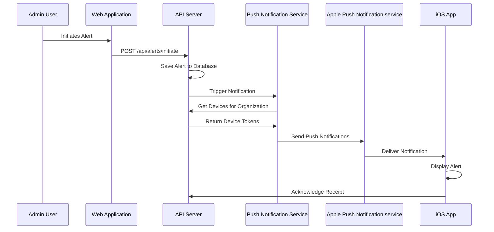
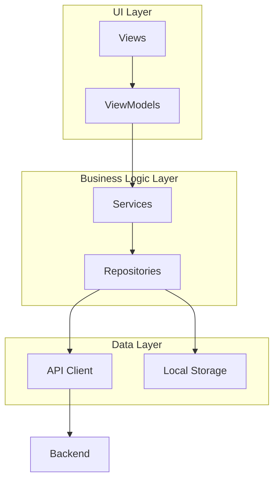
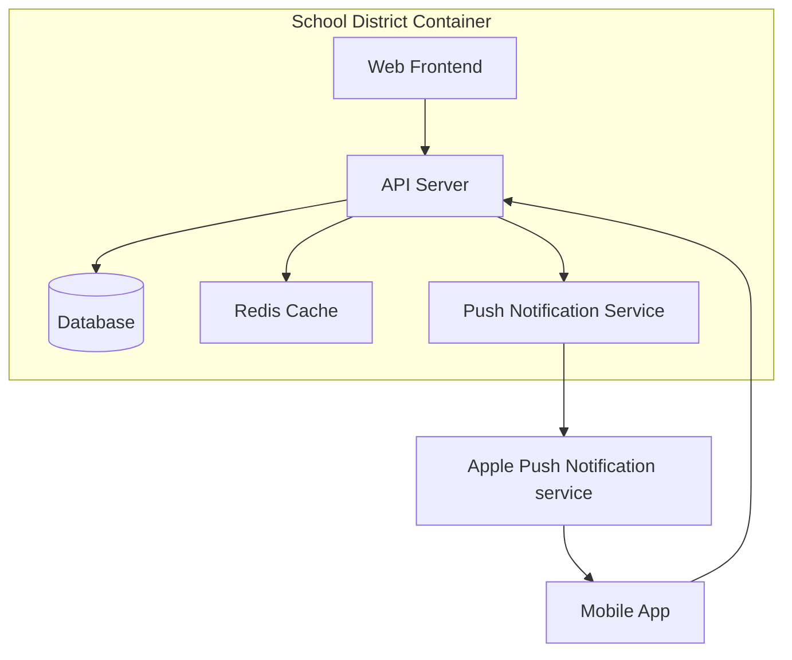

# iOS Companion App Technical Specification

This document provides detailed technical specifications for implementing the iOS companion app for the Campus Alert System, including backend services required to support it.

## Backend API Specification

### Core API Endpoints

#### Authentication

```
POST /api/auth/login
POST /api/auth/refresh
POST /api/auth/logout
GET /api/auth/me
```

#### Alert Management

```
GET /api/alerts/current
GET /api/alerts/history
POST /api/alerts/initiate
PUT /api/alerts/resolve
PUT /api/alerts/change-type
```

#### User Management

```
GET /api/users
GET /api/users/:id
POST /api/users
PUT /api/users/:id
DELETE /api/users/:id
```

#### Organization Management

```
GET /api/organizations
GET /api/organizations/:id
POST /api/organizations
PUT /api/organizations/:id
```

#### Device Registration

```
POST /api/devices/register
DELETE /api/devices/unregister
PUT /api/devices/update-token
```

### Database Schema

#### Users Table

```sql
CREATE TABLE users (
  id UUID PRIMARY KEY,
  organization_id UUID NOT NULL REFERENCES organizations(id),
  name VARCHAR(255) NOT NULL,
  email VARCHAR(255) NOT NULL UNIQUE,
  role VARCHAR(50) NOT NULL,
  avatar_url VARCHAR(255),
  created_at TIMESTAMP NOT NULL DEFAULT NOW(),
  updated_at TIMESTAMP NOT NULL DEFAULT NOW()
);
```

#### Organizations Table

```sql
CREATE TABLE organizations (
  id UUID PRIMARY KEY,
  name VARCHAR(255) NOT NULL,
  domain VARCHAR(255) NOT NULL UNIQUE,
  logo_url VARCHAR(255),
  primary_color VARCHAR(7),
  secondary_color VARCHAR(7),
  evacuation_location VARCHAR(255),
  shelter_hazard_type VARCHAR(255),
  created_at TIMESTAMP NOT NULL DEFAULT NOW(),
  updated_at TIMESTAMP NOT NULL DEFAULT NOW()
);
```

#### Alerts Table

```sql
CREATE TABLE alerts (
  id UUID PRIMARY KEY,
  organization_id UUID NOT NULL REFERENCES organizations(id),
  type VARCHAR(50) NOT NULL,
  initiated_by UUID NOT NULL REFERENCES users(id),
  timestamp TIMESTAMP NOT NULL DEFAULT NOW(),
  active BOOLEAN NOT NULL DEFAULT TRUE,
  resolved_by UUID REFERENCES users(id),
  resolved_at TIMESTAMP,
  location VARCHAR(255),
  note TEXT,
  created_at TIMESTAMP NOT NULL DEFAULT NOW(),
  updated_at TIMESTAMP NOT NULL DEFAULT NOW()
);
```

#### Devices Table

```sql
CREATE TABLE devices (
  id UUID PRIMARY KEY,
  user_id UUID NOT NULL REFERENCES users(id),
  organization_id UUID NOT NULL REFERENCES organizations(id),
  device_token VARCHAR(255) NOT NULL,
  device_type VARCHAR(50) NOT NULL,
  device_name VARCHAR(255),
  os_version VARCHAR(50),
  app_version VARCHAR(50),
  last_active TIMESTAMP,
  created_at TIMESTAMP NOT NULL DEFAULT NOW(),
  updated_at TIMESTAMP NOT NULL DEFAULT NOW()
);
```

### Authentication Flow

1. **Web Authentication**:
   - Continue using Microsoft OAuth for web authentication
   - Implement JWT token issuance after successful OAuth authentication

2. **Mobile Authentication**:
   - Implement OAuth 2.0 authorization code flow with PKCE
   - Support for Microsoft authentication in iOS app
   - Token refresh mechanism for maintaining sessions

3. **Multi-tenancy Authentication**:
   - Include organization identifier in authentication process
   - Validate user belongs to the specified organization
   - Support for users with multiple organization memberships

## Push Notification Service

### Architecture



### Notification Payload Structure

```json
{
  "aps": {
    "alert": {
      "title": "LOCKDOWN ALERT",
      "body": "Lockdown! Locks, Lights, Out of Sight!"
    },
    "sound": "critical.aiff",
    "category": "ALERT_CATEGORY",
    "critical": 1,
    "thread-id": "campus-alerts"
  },
  "alertId": "550e8400-e29b-41d4-a716-446655440000",
  "alertType": "lockdown",
  "timestamp": "2025-05-18T22:30:00Z",
  "initiatedBy": "Jane Smith",
  "organizationId": "113e8400-e29b-41d4-a716-446655440113"
}
```

### Notification Categories and Actions

1. **Admin Alert Actions**:
   - Resolve Alert
   - Change Alert Type
   - View Details

2. **User Alert Actions**:
   - Acknowledge
   - View Instructions
   - Mark Safe

## iOS Application Specification

### Application Architecture

The iOS app will follow the MVVM (Model-View-ViewModel) architecture pattern with SwiftUI for the UI layer.



### Core Features

1. **Authentication**:
   - Login screen with organization selection
   - Support for Microsoft OAuth
   - Secure token storage using Keychain
   - Automatic token refresh

2. **Alert Management**:
   - View current active alert
   - Alert history with filtering options
   - Initiate alerts (admin only)
   - Resolve alerts (admin only)
   - Change alert type (admin only)

3. **Push Notifications**:
   - Registration with APNs
   - Handling foreground and background notifications
   - Rich notification support with custom UI
   - Action buttons in notifications

4. **Offline Support**:
   - Cache current alert status
   - Store alert history locally
   - Queue actions for sync when online
   - Background sync when connection is restored

### UI/UX Design Guidelines

1. **Alert Status Indicators**:
   - Color-coded based on alert type
   - Hold: Amber
   - Secure: Blue
   - Lockdown: Red
   - Evacuate: Orange
   - Shelter: Purple

2. **Accessibility**:
   - Support for Dynamic Type
   - VoiceOver compatibility
   - High contrast mode
   - Haptic feedback for critical alerts

3. **Responsive Design**:
   - Support for all iPhone sizes
   - iPad support with split-view
   - Landscape and portrait orientations

### Local Storage

1. **User Preferences**:
   - UserDefaults for app settings
   - Keychain for sensitive information

2. **Alert Cache**:
   - Core Data for storing alert history
   - SQLite for efficient querying

3. **Offline Queue**:
   - Core Data for storing pending actions
   - Background processing for sync

## Multi-Tenant Container Deployment

### Container Structure



### Deployment Configuration

Each school district will have its own container deployment with:

1. **Environment Variables**:
   - `ORGANIZATION_ID`: Unique identifier for the school district
   - `ORGANIZATION_NAME`: Name of the school district
   - `DOMAIN`: Domain name for the school district
   - `PRIMARY_COLOR`: Primary brand color
   - `SECONDARY_COLOR`: Secondary brand color
   - `EVACUATION_LOCATION`: Default evacuation location
   - `SHELTER_HAZARD_TYPE`: Default hazard type for shelter alerts
   - `APNS_KEY_ID`: APNs key ID for push notifications
   - `APNS_TEAM_ID`: APNs team ID for push notifications
   - `APNS_KEY_PATH`: Path to APNs private key file
   - `MS_CLIENT_ID`: Microsoft OAuth client ID
   - `MS_TENANT_ID`: Microsoft OAuth tenant ID
   - `MS_REDIRECT_URI`: Microsoft OAuth redirect URI

2. **Volume Mounts**:
   - Database data
   - Logs
   - APNs certificates
   - Custom assets (logos, etc.)

### Organization Onboarding Process

1. **Registration**:
   - School district administrator registers for the service
   - Provides domain information and Microsoft tenant details
   - Uploads organization logo and configures branding

2. **Container Provisioning**:
   - Automated provisioning of container instance
   - Database initialization with organization schema
   - Configuration of environment variables

3. **Mobile App Configuration**:
   - Generation of unique QR code for the organization
   - Creation of deep link URL for email invitations
   - Registration in the central directory service

## Security Considerations

1. **Data Protection**:
   - Encryption of data at rest and in transit
   - Secure storage of authentication tokens
   - Regular security audits and penetration testing

2. **Access Control**:
   - Role-based access control (RBAC)
   - IP-based restrictions for admin access
   - Two-factor authentication for sensitive operations

3. **Compliance**:
   - FERPA compliance for educational data
   - GDPR considerations for personal data
   - Regular data protection impact assessments

## Testing Strategy

1. **Unit Testing**:
   - Test individual components in isolation
   - Mock external dependencies
   - Achieve high code coverage

2. **Integration Testing**:
   - Test API endpoints with realistic data
   - Verify database interactions
   - Test authentication flows

3. **UI Testing**:
   - Automated UI tests for critical paths
   - Accessibility testing
   - Cross-device testing

4. **Push Notification Testing**:
   - Test delivery and handling of different notification types
   - Verify background and foreground handling
   - Test notification actions

5. **Load Testing**:
   - Simulate high volume of concurrent alerts
   - Test push notification throughput
   - Verify system performance under load

## Implementation Roadmap

### Phase 1: Backend Development (Weeks 1-6)

1. **Week 1-2**: Set up project structure and database schema
2. **Week 3-4**: Implement core API endpoints and authentication
3. **Week 5-6**: Develop multi-tenancy support and containerization

### Phase 2: Push Notification Service (Weeks 7-10)

1. **Week 7-8**: Implement APNs integration and notification dispatcher
2. **Week 9-10**: Create notification templates and test delivery

### Phase 3: iOS App Development (Weeks 11-18)

1. **Week 11-12**: Set up project structure and implement authentication
2. **Week 13-14**: Develop core UI components and alert management
3. **Week 15-16**: Implement push notification handling and offline support
4. **Week 17-18**: Add admin features and organization linking

### Phase 4: Testing and Deployment (Weeks 19-24)

1. **Week 19-20**: Conduct internal testing and bug fixing
2. **Week 21-22**: Deploy to TestFlight for beta testing
3. **Week 23-24**: Prepare for App Store submission and production deployment
