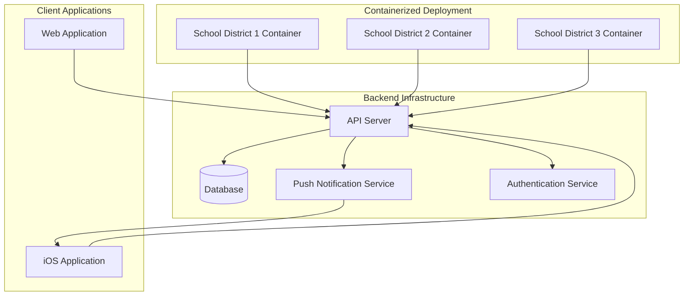

# iOS Companion App for Campus Alert System

## Current System Overview

The existing Campus Alert System is:
- A React web application with TypeScript
- Containerized with Docker and Nginx
- Uses Microsoft OAuth for production authentication
- Manages different alert types (hold, secure, lockdown, evacuate, shelter)
- Has role-based permissions (user, admin, super-admin)
- Currently stores alerts in localStorage (which would need to be replaced with a proper backend)

## iOS Companion App Architecture

Here's the proposed architecture for the iOS companion app and the necessary backend changes:

## Implementation Plan

### 1. Backend Infrastructure Enhancement

First, we need to enhance the backend to support mobile clients and push notifications:

1. **Create a RESTful API**:
   - Convert the current client-side alert management to a server-based solution
   - Implement endpoints for authentication, alert management, and user management
   - Store data in a proper database instead of localStorage

2. **Authentication System**:
   - Extend the Microsoft OAuth implementation to support mobile authentication flows
   - Implement token-based authentication (JWT) for mobile clients
   - Add organization/tenant identification in the authentication process

3. **Push Notification Service**:
   - Integrate with Apple Push Notification Service (APNs)
   - Create a notification dispatcher that sends alerts to all registered devices
   - Implement notification templates for different alert types

4. **Multi-tenancy Support**:
   - Design the database schema to support multiple organizations
   - Implement organization-specific configurations and branding
   - Create isolation between different school districts' data

### 2. iOS Application Development

1. **Core Application**:
   - Swift-based iOS application using SwiftUI for modern UI
   - Implement the same alert types and procedures as the web app
   - Create role-based interfaces (user, admin, super-admin)

2. **Authentication**:
   - Implement OAuth authentication flow for iOS
   - Store authentication tokens securely using Keychain
   - Handle organization/tenant selection during login

3. **Push Notification Handling**:
   - Register device with APNs
   - Implement notification handlers for different alert types
   - Create rich notifications with action buttons for admins

4. **Offline Support**:
   - Cache critical data for offline access
   - Queue actions performed offline to sync when connection is restored
   - Provide visual indicators for connection status

### 3. Containerization and Deployment

1. **Container Architecture**:
   - Extend current Docker setup to include the new backend services
   - Create a multi-container deployment with Docker Compose
   - Implement environment-specific configurations

2. **Organization Onboarding**:
   - Design a process for new school districts to deploy their own instance
   - Create configuration templates for different deployment scenarios
   - Develop documentation for IT administrators

3. **Mobile App Distribution**:
   - Publish the iOS app to the App Store
   - Implement a mechanism for linking the app to specific organization instances
   - Consider using QR codes or deep links for easy onboarding

## Technical Stack Recommendations

1. **Backend**:
   - Node.js with Express or NestJS for the API
   - MongoDB or PostgreSQL for the database
   - Redis for caching and real-time features
   - Firebase Cloud Messaging or a custom APNs implementation for push notifications

2. **iOS App**:
   - Swift with SwiftUI for UI components
   - Combine framework for reactive programming
   - Alamofire for networking
   - Keychain for secure storage

3. **DevOps**:
   - Extend your Docker Compose setup for the new services
   - Implement CI/CD pipelines for both backend and iOS app
   - Set up monitoring and alerting for the production environment

## Implementation Phases

A phased approach is recommended:

1. **Phase 1: Backend Enhancement**
   - Develop the API server with authentication and alert management
   - Implement the database schema with multi-tenancy support
   - Set up the containerization for the enhanced backend

2. **Phase 2: Push Notification Service**
   - Implement the APNs integration
   - Create the notification dispatcher
   - Test the notification delivery and handling

3. **Phase 3: iOS App Development**
   - Develop the core application functionality
   - Implement authentication and organization linking
   - Add push notification handling

4. **Phase 4: Testing and Deployment**
   - Conduct thorough testing across different scenarios
   - Deploy to TestFlight for beta testing
   - Prepare for App Store submission

## Key Considerations

1. **Backend Technology Stack**: Consider preferences for backend technologies based on team expertise and scalability requirements.

2. **Platform Support**: Determine if Android support will be needed in the future, which might influence architectural decisions.

3. **Compliance Requirements**: Address data retention and compliance requirements (FERPA, etc.) early in the design process.

4. **Timeline**: Establish a realistic timeline for implementation, considering the complexity of each phase.

5. **Apple Developer Program**: Ensure membership in the Apple Developer Program for publishing iOS apps.

## Multi-Tenant Container Architecture

For school districts to run the app in containers and link to their organization:

1. **Container Configuration**:
   - Each school district gets a dedicated container instance
   - Configuration includes organization ID, branding, and specific settings
   - Environment variables control connection to shared or dedicated resources

2. **Mobile App Organization Linking**:
   - QR code scanning during first launch to link to specific organization
   - Deep linking support for email invitations
   - Organization selection screen for users with multiple affiliations

3. **Data Isolation**:
   - Database schema designed for multi-tenancy
   - Row-level security or separate schemas for complete isolation
   - Shared infrastructure with logical separation of data

This architecture allows for efficient resource utilization while maintaining separation between different school districts' data and configurations.
