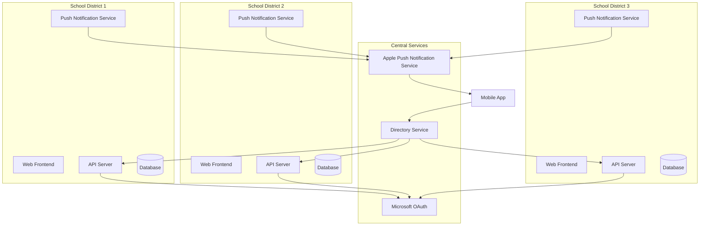

# Multi-Tenant Containerization for Campus Alert System

This document outlines the approach for implementing a multi-tenant containerization solution that allows different school districts to run the Campus Alert System in containers and link to their organization from mobile devices.

## Overview

The multi-tenant containerization architecture enables:

1. **Isolated Deployment**: Each school district gets its own isolated container environment
2. **Customization**: Organization-specific branding, settings, and configurations
3. **Mobile Integration**: Simple linking between mobile devices and specific organization instances
4. **Scalability**: Independent scaling based on each organization's needs
5. **Security**: Data isolation between different school districts

## Architecture



## Container Structure

Each school district's deployment consists of the following containers:

1. **Web Frontend**: Nginx serving the React application
2. **API Server**: Node.js backend with Express/NestJS
3. **Database**: PostgreSQL or MongoDB for data storage
4. **Redis**: For caching and real-time features
5. **Push Notification Service**: Service for sending push notifications via APNs

## Docker Compose Configuration

```yaml
version: '3.8'

services:
  # Web Frontend
  web:
    image: campusalert/web:latest
    container_name: ${ORGANIZATION_ID}-web
    ports:
      - "${WEB_PORT}:80"
    environment:
      - API_URL=http://api:3000
      - ORGANIZATION_ID=${ORGANIZATION_ID}
      - ORGANIZATION_NAME=${ORGANIZATION_NAME}
      - PRIMARY_COLOR=${PRIMARY_COLOR}
      - SECONDARY_COLOR=${SECONDARY_COLOR}
    depends_on:
      - api
    restart: unless-stopped

  # API Server
  api:
    image: campusalert/api:latest
    container_name: ${ORGANIZATION_ID}-api
    ports:
      - "${API_PORT}:3000"
    environment:
      - NODE_ENV=production
      - DATABASE_URL=postgresql://postgres:${DB_PASSWORD}@db:5432/${ORGANIZATION_ID}
      - REDIS_URL=redis://redis:6379
      - ORGANIZATION_ID=${ORGANIZATION_ID}
      - ORGANIZATION_NAME=${ORGANIZATION_NAME}
      - DOMAIN=${DOMAIN}
      - MS_CLIENT_ID=${MS_CLIENT_ID}
      - MS_TENANT_ID=${MS_TENANT_ID}
      - MS_REDIRECT_URI=${MS_REDIRECT_URI}
      - EVACUATION_LOCATION=${EVACUATION_LOCATION}
      - SHELTER_HAZARD_TYPE=${SHELTER_HAZARD_TYPE}
    volumes:
      - ./logs:/app/logs
    depends_on:
      - db
      - redis
    restart: unless-stopped

  # Push Notification Service
  push:
    image: campusalert/push:latest
    container_name: ${ORGANIZATION_ID}-push
    environment:
      - NODE_ENV=production
      - DATABASE_URL=postgresql://postgres:${DB_PASSWORD}@db:5432/${ORGANIZATION_ID}
      - REDIS_URL=redis://redis:6379
      - ORGANIZATION_ID=${ORGANIZATION_ID}
      - APNS_KEY_ID=${APNS_KEY_ID}
      - APNS_TEAM_ID=${APNS_TEAM_ID}
    volumes:
      - ./certs:/app/certs
      - ./logs:/app/logs
    depends_on:
      - api
      - redis
    restart: unless-stopped

  # Database
  db:
    image: postgres:14-alpine
    container_name: ${ORGANIZATION_ID}-db
    environment:
      - POSTGRES_PASSWORD=${DB_PASSWORD}
      - POSTGRES_DB=${ORGANIZATION_ID}
    volumes:
      - db-data:/var/lib/postgresql/data
    restart: unless-stopped

  # Redis
  redis:
    image: redis:alpine
    container_name: ${ORGANIZATION_ID}-redis
    volumes:
      - redis-data:/data
    restart: unless-stopped

volumes:
  db-data:
  redis-data:
```

## Environment Configuration

Each school district's deployment is configured using environment variables:

```env
# Organization Information
ORGANIZATION_ID=district123
ORGANIZATION_NAME=Springfield School District
DOMAIN=springfield.edu
PRIMARY_COLOR=#007bff
SECONDARY_COLOR=#6c757d

# Deployment Configuration
WEB_PORT=8080
API_PORT=3000
DB_PASSWORD=secure_password_here

# Alert Configuration
EVACUATION_LOCATION=Main Parking Lot
SHELTER_HAZARD_TYPE=Tornado

# Microsoft OAuth
MS_CLIENT_ID=microsoft_client_id_here
MS_TENANT_ID=microsoft_tenant_id_here
MS_REDIRECT_URI=https://api.springfield.edu/auth/callback

# Apple Push Notifications
APNS_KEY_ID=apns_key_id_here
APNS_TEAM_ID=apns_team_id_here
```

## Directory Service

The Directory Service is a central component that:

1. Maintains a registry of all organization deployments
2. Provides discovery for the mobile app to find the correct API endpoint
3. Generates and validates QR codes and deep links for organization linking

### API Endpoints

```
GET /api/directory/organizations
GET /api/directory/organizations/:id
POST /api/directory/organizations
PUT /api/directory/organizations/:id
DELETE /api/directory/organizations/:id
GET /api/directory/qr/:organizationId
POST /api/directory/validate-link
```

## Mobile App Organization Linking

### QR Code Linking

1. School district administrator generates a QR code from the admin panel
2. The QR code contains a deep link with the organization ID and API endpoint
3. Users scan the QR code with the mobile app
4. The app extracts the organization information and stores it locally
5. The app connects to the specific organization's API endpoint for all operations

### Deep Link Structure

```
campusalert://link?org=district123&endpoint=https://api.springfield.edu&name=Springfield%20School%20District
```

### Email Invitation

1. Administrator sends invitation emails to users
2. Email contains a deep link to the app with organization information
3. When clicked on a mobile device, the link opens the app and configures it for the organization
4. If the app is not installed, the link redirects to the App Store

## Deployment Process

### Initial Setup

1. **Registration**:
   - School district registers through a web portal
   - Provides domain, Microsoft OAuth information, and branding details
   - Configures alert settings (evacuation locations, etc.)

2. **Provisioning**:
   - System generates a unique organization ID
   - Creates configuration files and environment variables
   - Provisions container infrastructure

3. **Deployment**:
   - Containers are deployed using the configuration
   - Database is initialized with schema and default data
   - Organization is registered in the Directory Service

### Deployment Options

#### 1. Cloud-Hosted (SaaS Model)

- Containers run in a managed cloud environment
- School districts access their instance via a subdomain (e.g., springfield.campusalert.com)
- Fully managed by the service provider

#### 2. Self-Hosted (On-Premises)

- Docker Compose files and configurations are provided to the school district
- District IT department deploys on their own infrastructure
- Requires more technical expertise but offers more control

#### 3. Hybrid Model

- Core services (Directory, OAuth integration) are cloud-hosted
- School district data and containers run on-premises
- Combines security of on-premises with convenience of cloud

## Data Isolation

### Database Isolation

Three approaches to database isolation:

1. **Separate Databases**:
   - Each organization gets its own database instance
   - Complete isolation but higher resource usage

2. **Schema Separation**:
   - Single database with separate schemas for each organization
   - Good isolation with better resource efficiency

3. **Row-Level Security**:
   - Single database and schema with organization_id column on all tables
   - Database enforces access control based on organization_id
   - Most efficient but requires careful implementation

### API Isolation

1. **Request Validation**:
   - Every API request includes organization ID
   - Middleware validates that the authenticated user belongs to the specified organization
   - Prevents cross-organization data access

2. **JWT Claims**:
   - Organization ID is included in JWT tokens
   - Cannot be tampered with due to token signing
   - Used to enforce access control at the API level

## Security Considerations

### Authentication

1. **Microsoft OAuth Integration**:
   - Each school district uses their own Microsoft tenant
   - Users authenticate with their existing school credentials
   - Reduces account management overhead

2. **JWT Tokens**:
   - Short-lived access tokens (15-60 minutes)
   - Longer-lived refresh tokens (with secure storage)
   - Token rotation on suspicious activity

### Data Protection

1. **Encryption**:
   - Data encrypted at rest (database)
   - TLS for all communications
   - Secure storage of sensitive information (APNs certificates, etc.)

2. **Audit Logging**:
   - All alert actions are logged with user information
   - Logs are retained according to school district policies
   - Exportable for compliance purposes

### Container Security

1. **Image Security**:
   - Regular security scanning of container images
   - Minimal base images to reduce attack surface
   - No unnecessary packages or services

2. **Network Isolation**:
   - Internal services not exposed to the internet
   - Web application firewall for public endpoints
   - Network policies to restrict container communication

## Scaling Considerations

### Horizontal Scaling

1. **Web and API Tiers**:
   - Can be scaled horizontally for larger school districts
   - Load balancer distributes traffic

2. **Database Tier**:
   - Primary/replica setup for larger deployments
   - Read replicas for heavy reporting workloads

### Vertical Scaling

1. **Resource Allocation**:
   - Container resource limits adjusted based on district size
   - Smaller districts use minimal resources
   - Larger districts allocated more CPU/memory

## Monitoring and Management

### Centralized Monitoring

1. **Health Checks**:
   - Regular probes of all services
   - Automated alerting for service disruptions

2. **Usage Metrics**:
   - Track API calls, active users, and alert volume
   - Identify performance bottlenecks

### Management Console

1. **Admin Dashboard**:
   - Overview of all organization deployments
   - Health status and resource utilization
   - One-click access to logs and metrics

2. **Self-Service Tools**:
   - Organization administrators can adjust settings
   - Generate new QR codes and deep links
   - View usage statistics

## Implementation Steps

1. **Directory Service**:
   - Implement central registry of organizations
   - Create API for organization discovery
   - Build QR code and deep link generation

2. **Container Templates**:
   - Create base Docker images for each service
   - Develop Docker Compose templates
   - Implement environment-based configuration

3. **Deployment Automation**:
   - Build provisioning scripts
   - Create CI/CD pipelines for updates
   - Implement backup and restore procedures

4. **Mobile Integration**:
   - Implement QR code scanning in iOS app
   - Add deep link handling
   - Create organization selection interface

## Testing Strategy

1. **Multi-Tenant Isolation**:
   - Verify data isolation between organizations
   - Test cross-organization access attempts
   - Validate JWT claims enforcement

2. **Deployment Testing**:
   - Test provisioning of new organizations
   - Verify configuration propagation
   - Validate container orchestration

3. **Mobile Linking**:
   - Test QR code generation and scanning
   - Verify deep link functionality
   - Test organization switching in the app

## Conclusion

This multi-tenant containerization approach provides a flexible, secure, and scalable solution for deploying the Campus Alert System to multiple school districts. Each district gets its own isolated environment while benefiting from centralized management and updates. The mobile app integration through QR codes and deep links makes it easy for users to connect to their specific organization's instance.
